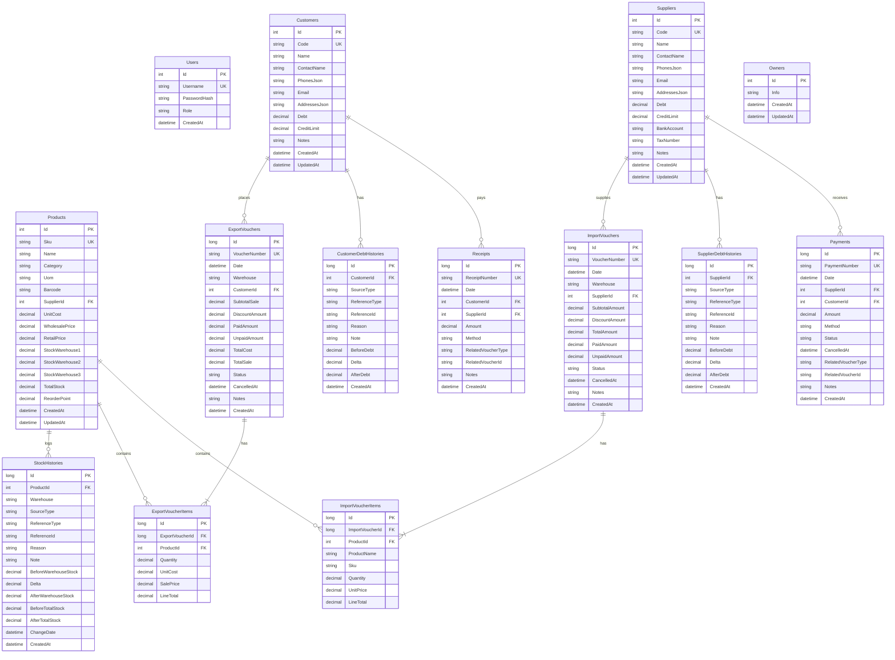

# TÀI LIỆU ĐẶC TẢ HỆ THỐNG VÀ THIẾT KẾ CƠ SỞ DỮ LIỆU
## Chuyển đổi dự án sang .NET 8 / 9 (ASP.NET Core Web API + Entity Framework Core)

---

## MỤC LỤC
1. [Tổng quan hệ thống](#1-tổng-quan-hệ-thống)
2. [Đặc tả nghiệp vụ chi tiết (Business Logic & Rules)](#2-đặc-tả-nghiệp-vụ-chi-tiết-business-logic--rules)
   - 2.1. [Quy ước dấu công nợ (Debt Sign Convention)](#21-quy-ước-dấu-công-nợ-debt-sign-convention)
   - 2.2. [Quản lý Danh mục Sản phẩm & Kho đa điểm](#22-quản-lý-danh-mục-sản-phẩm--kho-đa-điểm)
   - 2.3. [Nghiệp vụ Bán hàng / Xuất kho (Export Voucher)](#23-nghiệp-vụ-bán-hàng--xuất-kho-export-voucher)
   - 2.4. [Nghiệp vụ Mua hàng / Nhập kho (Import Voucher)](#24-nghiệp-vụ-mua-hàng--nhập-kho-import-voucher)
   - 2.5. [Nghiệp vụ Phiếu Thu & Phiếu Chi (Receipts & Payments)](#25-nghiệp-vụ-phiếu-thu--phiếu-chi-receipts--payments)
   - 2.6. [Nghiệp vụ Điều chỉnh thủ công (Manual Adjustments)](#26-nghiệp-vụ-điều-chỉnh-thủ-công-manual-adjustments)
   - 2.7. [Nghiệp vụ Báo cáo Động theo Tháng (Stock & Debt Reports)](#27-nghiệp-vụ-báo-cáo-động-theo-tháng-stock--debt-reports)
3. [Thiết kế Cơ sở dữ liệu Quan hệ (Relational DB Design)](#3-thiết-kế-cơ-sở-dữ-liệu-quan-hệ-relational-db-design)
   - 3.1. [Sơ đồ ERD (Entity Relationship Diagram)](#31-sơ-đồ-erd-entity-relationship-diagram)
   - 3.2. [Đặc tả chi tiết từng bảng](#32-đặc-tả-chi-tiết-từng-bảng)
4. [Mã nguồn Entity C# mẫu (EF Core Model)](#4-mã-nguồn-entity-c-mẫu-ef-core-model)
5. [Danh mục API Endpoints & Request/Response DTOs](#5-danh-mục-api-endpoints--requestresponse-dtos)
6. [Lưu ý kỹ thuật quan trọng khi triển khai trên .NET](#6-lưu-ý-kỹ-thuật-quan-trọng-khi-triển-khai-trên-net)

---

## 1. TỔNG QUAN HỆ THỐNG

Hệ thống là ứng dụng phần mềm **Quản lý Bán hàng, Kho hàng đa điểm, Mua hàng, Công nợ hai chiều và Thu chi** phục vụ kinh doanh bán buôn/bán lẻ.

### Các phân hệ chính:
- **Quản lý danh mục & kho:** Quản lý sản phẩm, đơn vị tính, barcode, giá vốn, giá sỉ, giá lẻ và số lượng phân bổ trên 3 kho độc lập (`Kho 1`, `Kho 2`, `Kho 3`).
- **Sổ kho (Stock Ledger):** Lưu vết toàn bộ biến động kho từng sản phẩm với số tồn trước, độ lệch (`delta`), số tồn sau.
- **Bán hàng (Export):** Lập phiếu xuất bán, trừ tồn kho, tính chiết khấu, cập nhật công nợ khách hàng khi chưa thanh toán đủ.
- **Mua hàng (Import):** Lập phiếu nhập từ nhà cung cấp, tăng tồn kho, ghi nhận công nợ phải trả.
- **Sổ nợ (Debt Ledger):** Lưu vết chi tiết lịch sử nợ của Khách hàng (`CustomerDebtHistory`) và Nhà cung cấp (`SupplierDebtHistory`).
- **Thu - Chi tiền mặt/ngân hàng:** Lập phiếu thu (`Receipt`), phiếu chi (`Payment`), hỗ trợ hủy/khôi phục và tự động bù trừ công nợ.
- **Báo cáo định kỳ:** Báo cáo xuất-nhập-tồn và báo cáo tổng hợp công nợ theo tháng có khả năng tính toán số dư đầu kỳ/cuối kỳ theo dòng thời gian.

---

## 2. ĐẶC TẢ NGHIỆP VỤ CHI TIẾT (BUSINESS LOGIC & RULES)

### 2.1. Quy ước dấu công nợ (Debt Sign Convention)
Hệ thống sử dụng quy ước toán học thống nhất trên trường `Debt`:
- **`Debt > 0`**: Là khoản **Phải thu** (Receivable - Người ngoài đang nợ cửa hàng).
- **`Debt < 0`**: Là khoản **Phải trả** (Payable - Cửa hàng đang nợ người ngoài).

#### Bảng quy tắc biến động công nợ:
| Nghiệp vụ | Đối tượng | Delta | Ý nghĩa |
| :--- | :--- | :--- | :--- |
| **Bán hàng ghi nợ** (Phiếu xuất) | Khách hàng | `+UnpaidAmount` | Tăng nợ phải thu của khách |
| **Thu tiền khách** (Phiếu thu) | Khách hàng | `-Amount` | Giảm nợ phải thu của khách |
| **Hủy phiếu xuất** | Khách hàng | `-UnpaidAmount` | Khách không còn nợ khoản này |
| **Xóa phiếu thu** | Khách hàng | `+Amount` | Trả lại số nợ chưa thu |
| **Mua hàng ghi nợ** (Phiếu nhập) | Nhà cung cấp | `-UnpaidAmount` | Làm `Debt` âm thêm (tăng nghĩa vụ nợ phải trả) |
| **Chi tiền trả NCC** (Phiếu chi) | Nhà cung cấp | `+Amount` | Làm `Debt` tăng dần về 0 (giảm nợ phải trả) |
| **Hủy phiếu nhập** | Nhà cung cấp | `+UnpaidAmount` | Giảm nợ phải trả cho NCC |
| **Xóa / Hủy phiếu chi** | Nhà cung cấp | `-Amount` | Khôi phục lại khoản nợ chưa trả |

> **Công thức hiển thị lên giao diện:**
> - Phải thu (Receivable) = $\max(\text{Debt}, 0)$
> - Phải trả (Payable) = $\max(-\text{Debt}, 0)$

---

### 2.2. Quản lý Danh mục Sản phẩm & Kho đa điểm
- **Mã sản phẩm (SKU):** Nếu người dùng không nhập, tự sinh theo format: `SP + 6 số cuối của timestamp` (ví dụ `SP123456`).
- **3 Kho cố định:**
  - `warehouse1`: Kho 1 (mặc định)
  - `warehouse2`: Kho 2
  - `warehouse3`: Kho 3
- **Quy tắc tính tồn kho:**
  $$\text{TotalStock} = \text{StockWarehouse1} + \text{StockWarehouse2} + \text{StockWarehouse3}$$
- **Quy tắc Sổ kho (`StockHistory`):** Bất kỳ thao tác nào làm tăng/giảm tồn kho của sản phẩm (nhập, xuất, điều chỉnh, hoàn tác) **BẮT BUỘC** sinh 1 bản ghi lịch sử gồm:
  - `ProductId`, `Warehouse`
  - `BeforeWarehouseStock`
  - `Delta` (+ nếu tăng, - nếu giảm)
  - `AfterWarehouseStock = BeforeWarehouseStock + Delta`
  - `BeforeTotalStock`, `AfterTotalStock`
  - `SourceType`, `ReferenceType`, `ReferenceId`, `ChangeDate`, `Reason`, `Note`.

---

### 2.3. Nghiệp vụ Bán hàng / Xuất kho (Export Voucher)
#### Quy trình tạo phiếu xuất:
1. Tiếp nhận danh sách hàng bán: `ProductId`, `Quantity`, `SalePrice` (nếu không truyền giá thì lấy theo `RetailPrice` của sản phẩm).
2. Tính toán tài chính:
   - $\text{SubtotalSale} = \sum (\text{Quantity} \times \text{SalePrice})$
   - $\text{TotalCost} = \sum (\text{Quantity} \times \text{UnitCost})$
   - Tính chiết khấu:
     - Nếu theo %: $\text{DiscountAmount} = \text{SubtotalSale} \times \frac{\text{DiscountPercent}}{100}$
     - Nếu theo tiền mặt: $\text{DiscountAmount} = \text{DiscountValue}$
     - Ràng buộc: $0 \le \text{DiscountAmount} \le \text{SubtotalSale}$
   - $\text{TotalSale} = \text{SubtotalSale} - \text{DiscountAmount}$
   - $\text{PaidAmount} = \min(\text{TotalSale}, \text{RequestPaidAmount})$
   - $\text{UnpaidAmount} = \max(0, \text{TotalSale} - \text{PaidAmount})$
3. Lưu bản ghi `ExportVoucher` với trạng thái `active`.
4. Nếu `UnpaidAmount > 0`:
   - Tăng nợ khách hàng: `Customer.Debt += UnpaidAmount`.
   - Ghi bản ghi `CustomerDebtHistory` với `SourceType = "export"`, `ReferenceType = "export_voucher"`.
5. Trừ kho:
   - Với mỗi sản phẩm: trừ tồn kho của kho được chọn (`delta = -Quantity`).
   - Ghi bản ghi `StockHistory` với `SourceType = "export"`.

#### Hủy (`cancel`) và Khôi phục (`restore`) phiếu xuất:
- **Hủy phiếu (`status: cancelled`):**
  - Trả lại hàng về kho: `delta = +Quantity` cho từng item.
  - Trừ lại công nợ khách hàng: `delta = -UnpaidAmount`.
  - Cập nhật phiếu: `Status = "cancelled"`, `CancelledAt = DateTime.UtcNow`.
- **Khôi phục phiếu (`status: active`):**
  - Trừ hàng khỏi kho: `delta = -Quantity`.
  - Cộng lại công nợ khách hàng: `delta = +UnpaidAmount`.
  - Cập nhật phiếu: `Status = "active"`, `CancelledAt = null`.

#### Xóa phiếu xuất (`DELETE`):
- Nếu phiếu đang `active`: Tự động kích hoạt nghiệp vụ hoàn kho và hoàn nợ tương tự như Hủy phiếu, sau đó mới xóa bản ghi khỏi CSDL.

---

### 2.4. Nghiệp vụ Mua hàng / Nhập kho (Import Voucher)
#### Quy trình tạo phiếu nhập:
1. Tiếp nhận thông tin: `SupplierId`, `Warehouse`, `Items` (`ProductId`, `Quantity`, `UnitPrice`).
2. Tự sinh số phiếu nhập nếu không truyền: format `PN + 6 số cuối timestamp`.
3. Tính toán tài chính:
   - $\text{SubtotalAmount} = \sum (\text{Quantity} \times \text{UnitPrice})$
   - $\text{TotalAmount} = \max(0, \text{SubtotalAmount} - \text{DiscountAmount})$
   - $\text{PaidAmount} = \min(\text{TotalAmount}, \text{RequestPaidAmount})$
   - $\text{UnpaidAmount} = \max(0, \text{TotalAmount} - \text{PaidAmount})$
4. Lưu bản ghi `ImportVoucher` với `status: confirmed`.
5. Cộng kho:
   - Tăng số lượng hàng trong kho tương ứng: `delta = +Quantity`.
   - Ghi bản ghi `StockHistory` với `SourceType = "import"`.
6. Nếu `UnpaidAmount > 0`:
   - Ghi nhận nợ phải trả NCC: `Supplier.Debt += (-UnpaidAmount)`.
   - Ghi bản ghi `SupplierDebtHistory` với `SourceType = "import"`.

#### Hủy / Khôi phục / Xóa phiếu nhập:
- **Hủy phiếu:** Trừ tồn kho (`delta = -Quantity`), giảm nợ NCC (`delta = +UnpaidAmount`), chuyển trạng thái `cancelled`.
- **Khôi phục phiếu:** Cộng tồn kho (`delta = +Quantity`), tăng nợ NCC (`delta = -UnpaidAmount`), chuyển trạng thái `confirmed`.
- **Xóa phiếu:** Hoàn lại kho và nợ nếu chưa hủy, sau đó xóa bản ghi.

---

### 2.5. Nghiệp vụ Phiếu Thu & Phiếu Chi (Receipts & Payments)

#### Phiếu thu (`Receipt`):
- Mã phiếu tự sinh: `PT + 8 số cuối timestamp`.
- Áp dụng khi thu tiền từ **Khách hàng** (hoặc NCC hoàn tiền):
  - Thu từ Khách hàng: `Customer.Debt -= Amount` (delta = `-Amount`), ghi `CustomerDebtHistory`.
  - Xóa phiếu thu: Hoàn nợ lại cho khách `Customer.Debt += Amount` (delta = `+Amount`).

#### Phiếu chi (`Payment`):
- Mã phiếu tự sinh: `PC + 8 số cuối timestamp`.
- Áp dụng khi chi tiền trả cho **Nhà cung cấp** (hoặc chi hoàn tiền cho Khách):
  - Chi trả NCC: `Supplier.Debt += Amount` (delta = `+Amount`), làm nợ âm tiến về 0, ghi `SupplierDebtHistory`.
  - Hủy phiếu chi: `Supplier.Debt -= Amount` (delta = `-Amount`).
  - Khôi phục phiếu chi: `Supplier.Debt += Amount` (delta = `+Amount`).
  - Xóa phiếu chi: Nếu phiếu đang hiệu lực, trừ nợ `Supplier.Debt -= Amount` trước khi xóa.

---

### 2.6. Nghiệp vụ Điều chỉnh thủ công (Manual Adjustments)
- **Điều chỉnh tồn kho (`stock-adjust`):**
  - Cho phép chọn kho cụ thể (`warehouse1`, `warehouse2`, `warehouse3`).
  - Cho phép nhập trực tiếp số lượng tồn thực tế (`newQuantity` $\rightarrow$ `delta = newQuantity - current`) hoặc nhập số lượng chênh lệch (`delta`).
  - Ghi sổ `StockHistory` với `SourceType = "manual_adjustment"`.
- **Điều chỉnh công nợ (`debt-adjust`):**
  - Áp dụng cho cả Khách hàng và Nhà cung cấp.
  - Cho phép nhập số nợ mới (`newDebt`) hoặc số nợ tăng/giảm (`delta`).
  - Ghi sổ `CustomerDebtHistory` hoặc `SupplierDebtHistory` với `SourceType = "manual_adjustment"`.

---

### 2.7. Nghiệp vụ Báo cáo Động theo Tháng (Stock & Debt Reports)

Cơ chế tính toán lùi kỳ (**Time-travel aggregation**) giúp hệ thống không phụ thuộc vào việc chốt sổ tĩnh:

#### A. Báo cáo Xuất - Nhập - Tồn (`/api/reports/stock?month=YYYY-MM`):
1. Xác định kỳ báo cáo: $[Start, End)$ của tháng được chọn.
2. Với mỗi sản phẩm:
   - Lấy số tồn hiện tại trong CSDL: $Stock_{current}$.
   - Tính tổng biến động sau kỳ báo cáo ($\ge End$): $\Delta_{after} = \sum Delta$.
   - Tính tổng biến động trong kỳ ($[Start, End)$): $\Delta_{month} = \sum Delta$.
   - **Tồn cuối kỳ:** $Stock_{closing} = Stock_{current} - \Delta_{after}$.
   - **Tồn đầu kỳ:** $Stock_{opening} = Stock_{closing} - \Delta_{month}$.
   - Tách thành số Nhập trong kỳ ($\Delta > 0$) và số Xuất trong kỳ ($\Delta < 0$).
   - Tính chi tiết tương tự cho từng kho (`warehouse1`, `warehouse2`, `warehouse3`).
   - Tính định giá: Giá vốn = $Stock \times UnitCost$, Giá sỉ = $Stock \times WholesalePrice$, Giá lẻ = $Stock \times RetailPrice$.

#### B. Báo cáo Tổng hợp Công nợ (`/api/reports/debts?month=YYYY-MM`):
1. Dựa trên `CustomerDebtHistory` và `SupplierDebtHistory`:
   - $Debt_{closing} = Debt_{current} - \Delta_{after}$
   - $Debt_{opening} = Debt_{closing} - \Delta_{month}$
2. Phân loại:
   - Số phát sinh tăng phải thu / giảm phải trả: $\Delta > 0$.
   - Số phát sinh giảm phải thu / tăng phải trả: $\Delta < 0$.
3. Tổng hợp số dư đầu kỳ, cuối kỳ, công nợ phải thu và phải trả toàn hệ thống.

---

## 3. THIẾT KẾ CƠ SỞ DỮ LIỆU QUAN HỆ (RELATIONAL DB DESIGN)

### 3.1. Sơ đồ ERD (Entity Relationship Diagram)



---

### 3.2. Đặc tả chi tiết từng bảng

#### 1. Bảng `Users`
| Tên cột | Kiểu C# | Kiểu CSDL | Ràng buộc | Mô tả |
| :--- | :--- | :--- | :--- | :--- |
| `Id` | `int` | `INT IDENTITY` | PK | Mã định danh người dùng |
| `Username` | `string` | `VARCHAR(50)` | NOT NULL, UNIQUE | Tên đăng nhập |
| `PasswordHash`| `string` | `VARCHAR(255)`| NOT NULL | Mật khẩu (băm BCrypt / ASP.NET Identity) |
| `Role` | `string` | `VARCHAR(30)` | NOT NULL, Default: 'user' | Quyền hạn (admin, user) |
| `CreatedAt` | `DateTime` | `DATETIME2` | Default: UTC Now | Thời điểm tạo |

#### 2. Bảng `Customers`
| Tên cột | Kiểu C# | Kiểu CSDL | Ràng buộc | Mô tả |
| :--- | :--- | :--- | :--- | :--- |
| `Id` | `int` | `INT IDENTITY` | PK | Mã khách hàng nội bộ |
| `Code` | `string` | `VARCHAR(30)` | NOT NULL, UNIQUE | Mã hiển thị (`KHxxxxxx`) |
| `Name` | `string` | `NVARCHAR(200)`| NOT NULL | Tên khách hàng |
| `ContactName`| `string?` | `NVARCHAR(100)`| NULL | Người liên hệ |
| `PhonesJson` | `string?` | `NVARCHAR(MAX)`| NULL | Danh sách SĐT (Lưu JSON mảng chuỗi) |
| `Email` | `string?` | `VARCHAR(100)` | NULL | Email |
| `AddressesJson`| `string?`| `NVARCHAR(MAX)`| NULL | Danh sách địa chỉ (Lưu JSON mảng chuỗi) |
| `Debt` | `decimal` | `DECIMAL(18,2)`| NOT NULL, Default: 0 | Công nợ hiện tại (>0: khách nợ mình) |
| `CreditLimit`| `decimal` | `DECIMAL(18,2)`| NOT NULL, Default: 0 | Hạn mức nợ tối đa |
| `Notes` | `string?` | `NVARCHAR(1000)`| NULL | Ghi chú |
| `CreatedAt` | `DateTime` | `DATETIME2` | Default: UTC Now | Ngày tạo |
| `UpdatedAt` | `DateTime` | `DATETIME2` | Default: UTC Now | Ngày cập nhật |

#### 3. Bảng `Suppliers`
| Tên cột | Kiểu C# | Kiểu CSDL | Ràng buộc | Mô tả |
| :--- | :--- | :--- | :--- | :--- |
| `Id` | `int` | `INT IDENTITY` | PK | Mã nhà cung cấp nội bộ |
| `Code` | `string` | `VARCHAR(30)` | NOT NULL, UNIQUE | Mã hiển thị (`NCCxxxxxx`) |
| `Name` | `string` | `NVARCHAR(200)`| NOT NULL | Tên nhà cung cấp |
| `ContactName`| `string?` | `NVARCHAR(100)`| NULL | Người liên hệ |
| `PhonesJson` | `string?` | `NVARCHAR(MAX)`| NULL | Danh sách SĐT (JSON array) |
| `Email` | `string?` | `VARCHAR(100)` | NULL | Email |
| `AddressesJson`| `string?`| `NVARCHAR(MAX)`| NULL | Danh sách địa chỉ (JSON array) |
| `Debt` | `decimal` | `DECIMAL(18,2)`| NOT NULL, Default: 0 | Công nợ hiện tại (<0: mình nợ NCC) |
| `CreditLimit`| `decimal` | `DECIMAL(18,2)`| NOT NULL, Default: 0 | Hạn mức nợ |
| `BankAccount`| `string?` | `VARCHAR(100)` | NULL | Số tài khoản ngân hàng |
| `TaxNumber` | `string?` | `VARCHAR(50)` | NULL | Mã số thuế |
| `Notes` | `string?` | `NVARCHAR(1000)`| NULL | Ghi chú |
| `CreatedAt` | `DateTime` | `DATETIME2` | Default: UTC Now | Ngày tạo |
| `UpdatedAt` | `DateTime` | `DATETIME2` | Default: UTC Now | Ngày cập nhật |

#### 4. Bảng `Products`
| Tên cột | Kiểu C# | Kiểu CSDL | Ràng buộc | Mô tả |
| :--- | :--- | :--- | :--- | :--- |
| `Id` | `int` | `INT IDENTITY` | PK | ID sản phẩm |
| `Sku` | `string` | `VARCHAR(50)` | NOT NULL, UNIQUE | Mã sản phẩm (`SPxxxxxx`) |
| `Name` | `string` | `NVARCHAR(255)`| NOT NULL | Tên hàng hóa |
| `Category` | `string?` | `NVARCHAR(100)`| NULL | Nhóm hàng |
| `Uom` | `string?` | `NVARCHAR(50)` | NULL | Đơn vị tính (Cái, Hộp, Kg...) |
| `Barcode` | `string?` | `VARCHAR(100)` | NULL | Mã vạch quét barcode |
| `SupplierId`| `int?` | `INT` | FK -> Suppliers | Nhà cung cấp chính |
| `UnitCost` | `decimal` | `DECIMAL(18,2)`| NOT NULL, Default: 0 | Giá vốn nhập hàng |
| `WholesalePrice`| `decimal` | `DECIMAL(18,2)`| NOT NULL, Default: 0 | Giá bán sỉ / buôn |
| `RetailPrice`| `decimal` | `DECIMAL(18,2)`| NOT NULL, Default: 0 | Giá bán lẻ niêm yết |
| `StockWarehouse1`| `decimal`| `DECIMAL(18,3)`| NOT NULL, Default: 0 | Tồn tại Kho 1 |
| `StockWarehouse2`| `decimal`| `DECIMAL(18,3)`| NOT NULL, Default: 0 | Tồn tại Kho 2 |
| `StockWarehouse3`| `decimal`| `DECIMAL(18,3)`| NOT NULL, Default: 0 | Tồn tại Kho 3 |
| `TotalStock` | `decimal` | `DECIMAL(18,3)`| NOT NULL, Default: 0 | Tổng tồn = Kho1 + Kho2 + Kho3 |
| `ReorderPoint`| `decimal` | `DECIMAL(18,3)`| NOT NULL, Default: 0 | Định mức tồn tối thiểu báo động |
| `CreatedAt` | `DateTime` | `DATETIME2` | Default: UTC Now | Ngày tạo |
| `UpdatedAt` | `DateTime` | `DATETIME2` | Default: UTC Now | Ngày cập nhật |

#### 5. Bảng `StockHistories` (Thẻ kho chi tiết)
| Tên cột | Kiểu C# | Kiểu CSDL | Ràng buộc | Mô tả |
| :--- | :--- | :--- | :--- | :--- |
| `Id` | `long` | `BIGINT IDENTITY`| PK | Khóa chính tăng tự động |
| `ProductId` | `int` | `INT` | FK -> Products, Index | Sản phẩm biến động |
| `Warehouse` | `string` | `VARCHAR(20)` | NOT NULL, Index | `warehouse1`, `warehouse2`, `warehouse3` |
| `SourceType`| `string` | `VARCHAR(50)` | NOT NULL | `import`, `export`, `manual_adjustment`,... |
| `ReferenceType`| `string?`| `VARCHAR(50)`| NULL | `export_voucher`, `import_voucher` |
| `ReferenceId`| `string?`| `VARCHAR(100)`| NULL | ID chứng từ gốc |
| `Reason` | `string?` | `NVARCHAR(255)`| NULL | Lý do biến động |
| `Note` | `string?` | `NVARCHAR(500)`| NULL | Ghi chú thêm |
| `BeforeWarehouseStock`| `decimal`| `DECIMAL(18,3)`| NOT NULL | Tồn kho cụ thể trước biến động |
| `Delta` | `decimal` | `DECIMAL(18,3)`| NOT NULL | Số lượng biến động (+ hoặc -) |
| `AfterWarehouseStock` | `decimal`| `DECIMAL(18,3)`| NOT NULL | Tồn kho cụ thể sau biến động |
| `BeforeTotalStock`| `decimal`| `DECIMAL(18,3)`| NOT NULL | Tổng tồn cả 3 kho trước biến động |
| `AfterTotalStock` | `decimal`| `DECIMAL(18,3)`| NOT NULL | Tổng tồn cả 3 kho sau biến động |
| `ChangeDate`| `DateTime` | `DATETIME2` | NOT NULL, Index | Ngày nghiệp vụ (tính báo cáo) |
| `CreatedAt` | `DateTime` | `DATETIME2` | Default: UTC Now | Thời điểm ghi hệ thống |

#### 6. Bảng `CustomerDebtHistories` & `SupplierDebtHistories`
| Tên cột | Kiểu C# | Kiểu CSDL | Ràng buộc | Mô tả |
| :--- | :--- | :--- | :--- | :--- |
| `Id` | `long` | `BIGINT IDENTITY`| PK | Khóa chính |
| `CustomerId` / `SupplierId` | `int` | `INT` | FK, Index | Đối tác nợ |
| `SourceType`| `string` | `VARCHAR(50)` | NOT NULL | `export`, `import`, `receipt`, `payment`,... |
| `ReferenceType`| `string?`| `VARCHAR(50)`| NULL | Loại chứng từ liên kết |
| `ReferenceId`| `string?`| `VARCHAR(100)`| NULL | ID chứng từ liên kết |
| `Reason` | `string?` | `NVARCHAR(255)`| NULL | Lý do |
| `Note` | `string?` | `NVARCHAR(500)`| NULL | Ghi chú |
| `BeforeDebt`| `decimal` | `DECIMAL(18,2)`| NOT NULL | Công nợ trước khi đổi |
| `Delta` | `decimal` | `DECIMAL(18,2)`| NOT NULL | Giá trị thay đổi |
| `AfterDebt` | `decimal` | `DECIMAL(18,2)`| NOT NULL | Công nợ sau khi đổi |
| `CreatedAt` | `DateTime` | `DATETIME2` | Default: UTC Now, Index | Thời điểm phát sinh nợ |

#### 7. Bảng `ExportVouchers` & `ExportVoucherItems`
* **`ExportVouchers`:**
  - `Id` (`long`, PK)
  - `VoucherNumber` (`string`, `VARCHAR(50)`, UNIQUE - ví dụ `PX20260501-001`)
  - `Date` (`DateTime`, Ngày xuất hàng)
  - `Warehouse` (`string`, `warehouse1`/`2`/`3`)
  - `CustomerId` (`int`, FK -> `Customers`)
  - `SubtotalSale` (`decimal(18,2)`, Tổng tiền hàng chưa trừ chiết khấu)
  - `DiscountAmount` (`decimal(18,2)`, Tiền chiết khấu)
  - `TotalSale` (`decimal(18,2)`, Tổng tiền khách phải thanh toán)
  - `PaidAmount` (`decimal(18,2)`, Tiền khách trả ngay lúc xuất)
  - `UnpaidAmount` (`decimal(18,2)`, Tiền còn thiếu ghi nợ)
  - `TotalCost` (`decimal(18,2)`, Tổng giá vốn của đơn hàng)
  - `Status` (`string`, `active` hoặc `cancelled`)
  - `CancelledAt` (`DateTime?`)
  - `Notes` (`string?`)
  - `CreatedAt` (`DateTime`)
* **`ExportVoucherItems`:**
  - `Id` (`long`, PK)
  - `ExportVoucherId` (`long`, FK -> `ExportVouchers`)
  - `ProductId` (`int`, FK -> `Products`)
  - `Quantity` (`decimal(18,3)`)
  - `UnitCost` (`decimal(18,2)`)
  - `SalePrice` (`decimal(18,2)`)
  - `LineTotal` (`decimal(18,2) = Quantity * SalePrice`)

#### 8. Bảng `ImportVouchers` & `ImportVoucherItems`
* **`ImportVouchers`:**
  - `Id` (`long`, PK)
  - `VoucherNumber` (`string`, `VARCHAR(50)`, UNIQUE - định dạng `PNxxxxxx`)
  - `Date` (`DateTime`, Ngày nhập hàng)
  - `Warehouse` (`string`, `warehouse1`/`2`/`3`)
  - `SupplierId` (`int`, FK -> `Suppliers`)
  - `SubtotalAmount` (`decimal(18,2)`)
  - `DiscountAmount` (`decimal(18,2)`)
  - `TotalAmount` (`decimal(18,2)`)
  - `PaidAmount` (`decimal(18,2)`)
  - `UnpaidAmount` (`decimal(18,2)`)
  - `Status` (`string`, `confirmed` hoặc `cancelled`)
  - `CancelledAt` (`DateTime?`)
  - `Notes` (`string?`)
  - `CreatedAt` (`DateTime`)
* **`ImportVoucherItems`:**
  - `Id` (`long`, PK)
  - `ImportVoucherId` (`long`, FK -> `ImportVouchers`)
  - `ProductId` (`int`, FK -> `Products`)
  - `ProductName` (`string`, Snapshot tên sản phẩm lúc nhập)
  - `Sku` (`string`, Snapshot SKU)
  - `Quantity` (`decimal(18,3)`)
  - `UnitPrice` (`decimal(18,2)`)
  - `LineTotal` (`decimal(18,2) = Quantity * UnitPrice`)

#### 9. Bảng `Receipts` & `Payments`
* **`Receipts` (Phiếu thu):**
  - `Id` (`long`, PK)
  - `ReceiptNumber` (`string`, UNIQUE, `PTxxxxxx`)
  - `Date` (`DateTime`)
  - `CustomerId` (`int?`, FK -> `Customers`, Nullable)
  - `SupplierId` (`int?`, FK -> `Suppliers`, Nullable)
  - `Amount` (`decimal(18,2)`)
  - `Method` (`string?`, Tiền mặt, Chuyển khoản...)
  - `RelatedVoucherType` (`string?`)
  - `RelatedVoucherId` (`string?`)
  - `Notes` (`string?`)
  - `CreatedAt` (`DateTime`)
* **`Payments` (Phiếu chi):**
  - `Id` (`long`, PK)
  - `PaymentNumber` (`string`, UNIQUE, `PCxxxxxx`)
  - `Date` (`DateTime`)
  - `SupplierId` (`int?`, FK -> `Suppliers`, Nullable)
  - `CustomerId` (`int?`, FK -> `Customers`, Nullable)
  - `Amount` (`decimal(18,2)`)
  - `Method` (`string?`)
  - `Status` (`string`, `confirmed` hoặc `cancelled`)
  - `CancelledAt` (`DateTime?`)
  - `RelatedVoucherType` (`string?`)
  - `RelatedVoucherId` (`string?`)
  - `Notes` (`string?`)
  - `CreatedAt` (`DateTime`)

#### 10. Bảng `Owners`
Lưu thông tin số tài khoản của chủ cửa hàng (in chân phiếu xuất):
- `Id` (`int`, PK)
- `Info` (`string`, `NVARCHAR(500)` - Ví dụ: *"TRẦN THỊ SỢI STK: 1048... Vietinbank"*)
- `CreatedAt`, `UpdatedAt` (`DateTime`)

---

## 4. MÃ NGUỒN ENTITY C# MẪU (EF CORE MODEL)

Dưới đây là một số class Entity cốt lõi cho .NET:

```csharp
namespace App.Domain.Entities;

public class Product
{
    public int Id { get; set; }
    public string Sku { get; set; } = string.Empty;
    public string Name { get; set; } = string.Empty;
    public string? Category { get; set; }
    public string? Uom { get; set; }
    public string? Barcode { get; set; }
    public int? SupplierId { get; set; }
    public Supplier? Supplier { get; set; }

    public decimal UnitCost { get; set; }
    public decimal WholesalePrice { get; set; }
    public decimal RetailPrice { get; set; }

    public decimal StockWarehouse1 { get; set; }
    public decimal StockWarehouse2 { get; set; }
    public decimal StockWarehouse3 { get; set; }
    public decimal TotalStock { get; set; }
    public decimal ReorderPoint { get; set; }

    public DateTime CreatedAt { get; set; } = DateTime.UtcNow;
    public DateTime UpdatedAt { get; set; } = DateTime.UtcNow;

    public ICollection<StockHistory> StockHistories { get; set; } = new List<StockHistory>();
}

public class StockHistory
{
    public long Id { get; set; }
    public int ProductId { get; set; }
    public Product Product { get; set; } = null!;

    public string Warehouse { get; set; } = "warehouse1";
    public string SourceType { get; set; } = "manual_adjustment";
    public string? ReferenceType { get; set; }
    public string? ReferenceId { get; set; }
    public string? Reason { get; set; }
    public string? Note { get; set; }

    public decimal BeforeWarehouseStock { get; set; }
    public decimal Delta { get; set; }
    public decimal AfterWarehouseStock { get; set; }
    public decimal BeforeTotalStock { get; set; }
    public decimal AfterTotalStock { get; set; }

    public DateTime ChangeDate { get; set; } = DateTime.UtcNow;
    public DateTime CreatedAt { get; set; } = DateTime.UtcNow;
}

public class Customer
{
    public int Id { get; set; }
    public string Code { get; set; } = string.Empty;
    public string Name { get; set; } = string.Empty;
    public string? ContactName { get; set; }
    public string? PhonesJson { get; set; }
    public string? Email { get; set; }
    public string? AddressesJson { get; set; }

    public decimal Debt { get; set; }
    public decimal CreditLimit { get; set; }
    public string? Notes { get; set; }

    public DateTime CreatedAt { get; set; } = DateTime.UtcNow;
    public DateTime UpdatedAt { get; set; } = DateTime.UtcNow;

    public ICollection<CustomerDebtHistory> DebtHistories { get; set; } = new List<CustomerDebtHistory>();
    public ICollection<ExportVoucher> ExportVouchers { get; set; } = new List<ExportVoucher>();
}

public class ExportVoucher
{
    public long Id { get; set; }
    public string VoucherNumber { get; set; } = string.Empty;
    public DateTime Date { get; set; } = DateTime.UtcNow;
    public string Warehouse { get; set; } = "warehouse1";

    public int CustomerId { get; set; }
    public Customer Customer { get; set; } = null!;

    public decimal SubtotalSale { get; set; }
    public decimal DiscountAmount { get; set; }
    public decimal TotalSale { get; set; }
    public decimal PaidAmount { get; set; }
    public decimal UnpaidAmount { get; set; }
    public decimal TotalCost { get; set; }

    public string Status { get; set; } = "active"; // "active" | "cancelled"
    public DateTime? CancelledAt { get; set; }
    public string? Notes { get; set; }
    public DateTime CreatedAt { get; set; } = DateTime.UtcNow;

    public ICollection<ExportVoucherItem> Items { get; set; } = new List<ExportVoucherItem>();
}
```

---

## 5. DANH MỤC API ENDPOINTS & REQUEST/RESPONSE DTOS

| Module | Method | Endpoint | Tham số Body / Query | Mô tả chức năng |
| :--- | :--- | :--- | :--- | :--- |
| **Auth** | `POST` | `/api/auth/login` | `{ username, password }` | Đăng nhập hệ thống |
| **Sản phẩm** | `GET` | `/api/products` | `?q=&supplierId=` | Lấy danh sách sản phẩm |
| | `POST` | `/api/products` | `CreateProductDto` | Thêm mới sản phẩm |
| | `PUT` | `/api/products/{id}` | `UpdateProductDto` | Cập nhật sản phẩm |
| | `POST` | `/api/products/{id}/stock-adjust` | `{ warehouse, delta, quantity, reason, note, changeDate }` | Điều chỉnh kiểm kê tồn kho |
| | `GET` | `/api/products/{id}/stock-history` | `?month=YYYY-MM` | Xem thẻ kho sản phẩm |
| **Khách hàng** | `GET` | `/api/customers` | `?q=` | Tìm kiếm khách hàng |
| | `POST` | `/api/customers` | `CreateCustomerDto` | Thêm mới khách hàng |
| | `PUT` | `/api/customers/{id}` | `UpdateCustomerDto` | Sửa thông tin khách hàng |
| | `GET` | `/api/customers/{id}/debt-history` | - | Lịch sử công nợ chi tiết |
| | `POST` | `/api/customers/{id}/debt-adjust` | `{ delta, newDebt, reason, note }` | Điều chỉnh công nợ khách |
| **Nhà cung cấp** | `GET` | `/api/suppliers` | `?q=` | Tìm kiếm NCC |
| | `POST` | `/api/suppliers` | `CreateSupplierDto` | Thêm mới NCC |
| | `PUT` | `/api/suppliers/{id}` | `UpdateSupplierDto` | Cập nhật NCC |
| | `GET` | `/api/suppliers/{id}/debt-history` | - | Lịch sử nợ NCC |
| | `POST` | `/api/suppliers/{id}/debt-adjust` | `{ delta, newDebt, reason, note }` | Điều chỉnh nợ NCC |
| **Xuất kho** | `GET` | `/api/exports` | `?customerId=&month=` | Lấy danh sách phiếu xuất |
| | `POST` | `/api/exports` | `CreateExportDto` | Tạo phiếu xuất bán hàng |
| | `PATCH` | `/api/exports/{id}/status` | `{ action: "cancel" \| "restore" }` | Hủy / Khôi phục phiếu |
| | `DELETE`| `/api/exports/{id}` | - | Xóa phiếu xuất |
| **Nhập kho** | `GET` | `/api/imports` | `?supplierId=&month=` | Lấy danh sách phiếu nhập |
| | `POST` | `/api/imports` | `CreateImportDto` | Tạo phiếu nhập mua hàng |
| | `PATCH` | `/api/imports/{id}/status` | `{ action: "cancel" \| "restore" }` | Hủy / Khôi phục phiếu |
| | `DELETE`| `/api/imports/{id}` | - | Xóa phiếu nhập |
| **Thu tiền** | `GET` | `/api/receipts` | `?customerId=&supplierId=&q=` | Danh sách phiếu thu |
| | `POST` | `/api/receipts` | `CreateReceiptDto` | Lập phiếu thu tiền |
| | `DELETE`| `/api/receipts/{id}` | - | Xóa phiếu thu |
| **Chi tiền** | `GET` | `/api/payments` | `?supplierId=&q=` | Danh sách phiếu chi |
| | `POST` | `/api/payments` | `CreatePaymentDto` | Lập phiếu chi tiền |
| | `PATCH` | `/api/payments/{id}/status` | `{ action: "cancel" \| "restore" }` | Hủy / Khôi phục phiếu chi |
| | `DELETE`| `/api/payments/{id}` | - | Xóa phiếu chi |
| **Báo cáo** | `GET` | `/api/reports/stock` | `?month=YYYY-MM` | Báo cáo tồn kho theo tháng |
| | `GET` | `/api/reports/debts` | `?month=YYYY-MM` | Báo cáo công nợ theo tháng |
| **Tài khoản** | `GET` | `/api/owners` | - | Danh sách tài khoản nhận tiền |

---

## 6. LƯU Ý KỸ THUẬT QUAN TRỌNG KHI TRIỂN KHAI TRÊN .NET

1. **Sử dụng DbContext Transaction:**
   Ở code Node.js cũ, nếu xảy ra lỗi giữa chừng (ví dụ trừ kho được 2 item nhưng item thứ 3 lỗi), code phải tự rollback thủ công bằng các câu lệnh xóa và bù trừ. Khi sang .NET, luôn bọc nghiệp vụ trong `IDbContextTransaction`:
   ```csharp
   await using var tx = await _dbContext.Database.BeginTransactionAsync();
   try 
   {
       // Các thao tác cập nhật Voucher, Stock, Debt
       await _dbContext.SaveChangesAsync();
       await tx.CommitAsync();
   }
   catch 
   {
       await tx.RollbackAsync();
       throw;
   }
   ```
2. **Kiểu dữ liệu tiền tệ và số lượng:**
   - Dùng `decimal` trong C# và `DECIMAL(18,2)` hoặc `DECIMAL(18,3)` trong SQL. Tuyệt đối không dùng `float` hay `double` để tránh sai số dấu phẩy động trong kế toán.
3. **Chống Over-selling (Bán âm kho):**
   - Phiên bản Node.js hiện tại cho phép xuất âm kho nếu số tồn không đủ. Nếu nghiệp vụ yêu cầu không cho phép bán âm, bạn có thể bổ sung kiểm tra: `if (product.StockWarehouse1 < item.Quantity) throw new InvalidOperationException("Kho không đủ hàng");`.
4. **Xử lý bất đồng bộ (Async/Await):**
   - Mọi truy vấn Entity Framework Core phải dùng các phương thức `...Async` (`ToListAsync()`, `FirstOrDefaultAsync()`, `SaveChangesAsync()`) để tối ưu luồng xử lý của Kestrel Server.
5. **CORS và Frontend React:**
   - Frontend hiện tại gọi các endpoint dạng `/api/...`. Trong file `Program.cs` của .NET nhớ bật CORS cho domain frontend:
   ```csharp
   builder.Services.AddCors(opts => {
       opts.AddDefaultPolicy(p => p.AllowAnyHeader().AllowAnyMethod().AllowCredentials().SetIsOriginAllowed(_ => true));
   });
   ```
